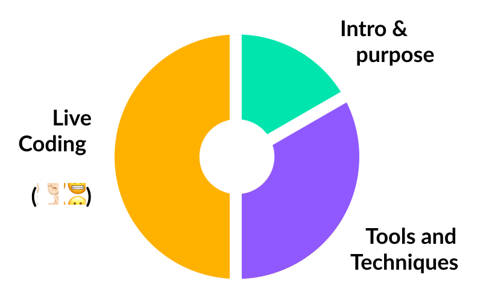
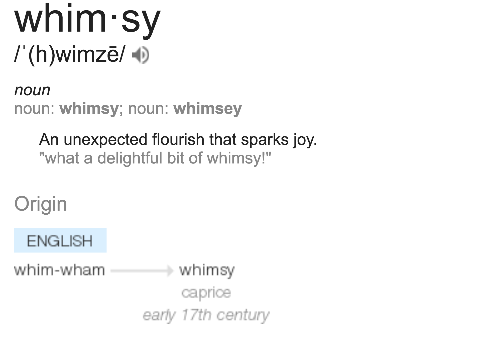
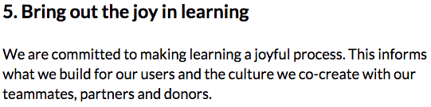
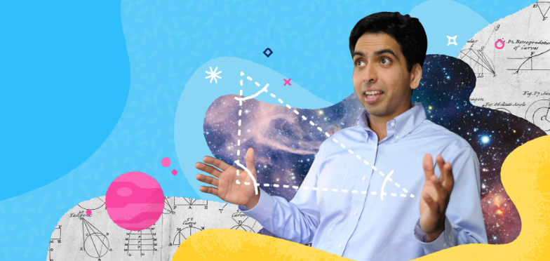
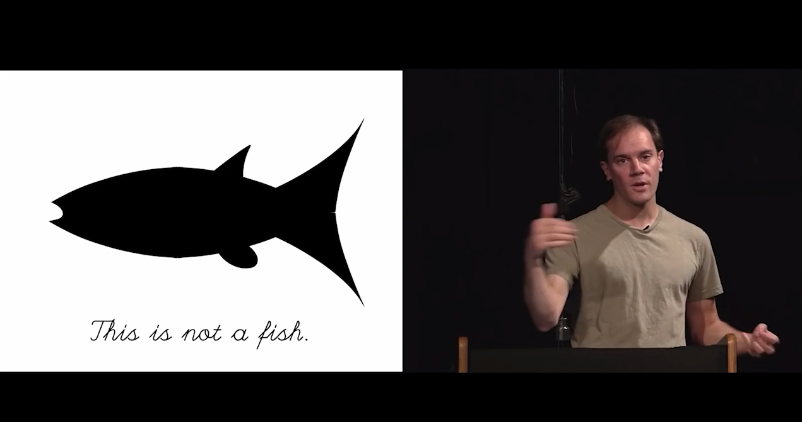
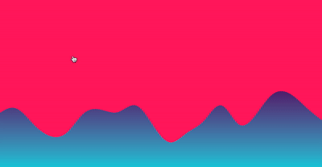
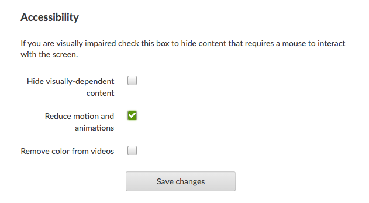

import { Head, Image } from 'mdx-deck';
import { CodeSurfer } from 'mdx-deck-code-surfer';
import { Value, Toggle } from 'react-powerplug'

export { default as theme } from './presentation-theme';

import Triggerable from './src/components/Triggerable';
import BookAnimation from './src/components/BookAnimation';

<Head>
  <title>Whimsical Web Animations</title>
</Head>

# Whimsical Web Animations

---



---

### "workshop"

---

# Part I: Introduction

---

### What do I mean by "Whimsy"?

---



---


---

<video
  controls
  loop
  src="presentation-assets/dumbledore.mp4"
  style={{
    width: '100%',
    margin: 'auto',
  }}
/>

---


<video
  controls
  loop
  src="presentation-assets/guppy.mp4"
  style={{
    width: '100%',
    margin: 'auto',
  }}
/>

---


---

## Why is this important?

Surely there are higher-priority things we could be doing with our limited dev time?

---

<div style={{ fontWeight: 'bold', fontSize: 72}}>"Khan Academy is boring"</div>

The #1 reason people don't use Khan, according to Nancy's US branding study

---

### It's one of our new core values.

<br />



---

## Design is thinking a lot about this.

---

## Wonder blocks is whimsical!

---



---


---


---


---

### Are illustrations sufficient?

---

<a href="https://www.youtube.com/watch?v=KUDh6sCtm8s" target="_blank">
  
</a>

https://www.youtube.com/watch?v=KUDh6sCtm8s

---

### The thing we'll build

---


---

<Triggerable>
  <BookAnimation />
</Triggerable>

---

## Part II: Tools

---

### CSS Transitions

---


import Button from '@khanacademy/wonder-blocks-button';

import ProgressBar from './src/components/Demo/ProgressBar';

<Value initial={0.5}>
  {({ value, set }) => (
    <React.Fragment>
      <ProgressBar
        width={300}
        height={15}
        progress={value}
      />
      <br />
      <Button onClick={() => set(Math.random())}>
        Set Random Value
      </Button>
    </React.Fragment>
  )}
</Value>


---

<CodeSurfer
  title="CSS transition component"
  code={require('!raw-loader!./src/components/Demo/ProgressBar_width.js')}
  lang="js"
  showNumbers={true}
  dark={false}
  steps={[
    {},
    { range: [5, 9] },
    { range: [10, 13], lines: [21] },
    { range: [14, 20] },
    { range: [24, 29] },
    { range: [30, 33] },
  ]}
/>
---

# 🙅🏼‍♀️

<span style={{ fontFamily: 'monospace' }}>width</span> is <strong>expensive</strong> to recompute on every frame

---

<CodeSurfer
  title="Optimized version"
  code={require('!raw-loader!./src/components/Demo/ProgressBar.js')}
  lang="js"
  showNumbers={true}
  dark={false}
  steps={[
    {},
    { range: [5, 9] },
    { range: [10, 13], lines: [22] },
    { range: [14, 21] },
    { lines: [19] },
    { range: [31, 36] }
  ]}
/>

---

<Value initial={0.5}>
  {({ value, set }) => (
    <React.Fragment>
      <ProgressBar
        width={300}
        height={15}
        progress={value}
      />
      <br />
      <Button onClick={() => set(Math.random())}>
        Set Random Value
      </Button>
    </React.Fragment>
  )}
</Value>

---

import ProgressBarKeyframes from './src/components/Demo/ProgressBar.keyframes';

<Value initial={0.5}>
  {({ value, set }) => (
    <Triggerable
      otherActions={
        <React.Fragment>
          <div style={{ width: 20}} />
          <Button onClick={() => set(Math.random())}>
            Set Random Value
          </Button>
        </React.Fragment>
      }
    >
      <ProgressBarKeyframes
        width={300}
        height={15}
        progress={value}
      />
    </Triggerable>
  )}
</Value>

---

### CSS Keyframe Animations

---

<CodeSurfer
  code={require('!raw-loader!./code-samples/css-animation.css')}
  lang="css"
  showNumbers={true}
  dark={false}
  steps={[{}]}
/>

---

<CodeSurfer
  code={require('!raw-loader!./code-samples/aphrodite-animation.js')}
  lang="js"
  showNumbers={true}
  dark={false}
  steps={[{}]}
/>
---

<CodeSurfer
  title="CSS animation component"
  code={require('!raw-loader!./src/components/Demo/FadeInComponent.js')}
  lang="js"
  showNumbers={true}
  dark={false}
  steps={[{}, { lines: [4] }, {range: [5, 10]}, { lines: [11] }, { range: [15, 18] }, { range: [20, 25] }]}
/>

---

<CodeSurfer
  title="In use"
  code={require('!raw-loader!./src/components/Demo/FadeInComponentInUse.js')}
  lang="js"
  showNumbers={true}
  dark={false}
  steps={[{ range: [1, 3] }]}
/>

---

## Also good for:

---

Looping animations (spinners):


<br /><br />

```
animationTimingFunction: 'linear',
animationIterationCount: 'infinite',
```

---

SFX:

---

### What if we want to fade out as well?

---

import ProgressBarInAndOut from './src/components/Demo/ProgressBar.fade-in-and-out';

<Value initial={0.5}>
  {({ value, set }) => (
    <Toggle initial={true}>
      {({ on, toggle }) => (
        <React.Fragment>
          <ProgressBarInAndOut
            width={300}
            height={15}
            progress={value}
            isVisible={on}
          />
          <Button onClick={toggle}>{on ? 'Unmount' : 'Remount'}</Button>
          &nbsp;
          <Button onClick={() => set(Math.random())}>
            Set Random Value
          </Button>
        </React.Fragment>
      )}
    </Toggle>
  )}
</Value>

---


<CodeSurfer
  code={require('!raw-loader!./src/components/Demo/FadeOutProblem.js')}
  lang="js"
  showNumbers={true}
  dark={false}
  steps={[{}]}
/>

---

### The solution:

`react-css-transition-group`, via `aphrodite-css-transition-group`

---

### Spring Physics

via React Motion

---


---



---

<CodeSurfer
  title="React Motion progress bar"
  code={require('!raw-loader!./src/components/Demo/ProgressBar.spring.js')}
  lang="js"
  showNumbers={true}
  dark={false}
  steps={[{}, { lines: [3] }, {range: [11, 14]}, { lines: [15] }, { lines: [16] }, {range: [17, 24]}, { lines: [22] }, { range: [37, 39] }]}
/>


---

import ProgressBarSpring from './src/components/Demo/ProgressBar.spring';

<Value initial={0.5}>
  {({ value, set }) => (
    <Toggle initial={true}>
      {({ on, toggle }) => (
        <React.Fragment>
          <ProgressBarSpring
            width={300}
            height={15}
            progress={value}
            isVisible={on}
          />
          <Button onClick={() => set(Math.random())}>
            Set Random Value
          </Button>
        </React.Fragment>
      )}
    </Toggle>
  )}
</Value>


---

<Value initial={0.5}>
  {({ value, set }) => (
    <React.Fragment>
      <ProgressBar
        width={300}
        height={15}
        progress={value}
      />
      <br />
      <Button onClick={() => set(Math.random())}>
        Set Random Value
      </Button>
    </React.Fragment>
  )}
</Value>

---

import ProgressBarSpringAdvanced from './src/components/Demo/ProgressBar.spring.advanced';

<Value initial={0.5}>
  {({ value, set }) => (
    <Toggle initial={true}>
      {({ on, toggle }) => (
        <React.Fragment>
          <ProgressBarSpringAdvanced
            width={300}
            height={15}
            progress={value}
            isVisible={on}
            stiffness={150}
            damping={10}
          />
          <Button onClick={() => set(Math.random())}>
            Set Random Value
          </Button>
        </React.Fragment>
      )}
    </Toggle>
  )}
</Value>


---

<a href="http://chenglou.github.io/react-motion/demos/demo5-spring-parameters-chooser/" target="_blank">
  Spring parameter chooser
</a>


---

React Motion is just a fancy number generator

---

### advantages:

- Incredibly smooth, organic motion
- Physics-based interrupts

---

### disadvantages:

- Can get stuttery during busy periods

---

<video
  loop
  controls
  src="presentation-assets/perff.mp4"
  style={{
    width: '100%',
    margin: 'auto',
  }}
/>

---

## a11y

---



---

```
KA.prefersReducedMotion()
```


---

# Part III:
# Let's build something!

---


<Triggerable>
  <BookAnimation />
</Triggerable>

---

# THE END

Feedback welcome!
