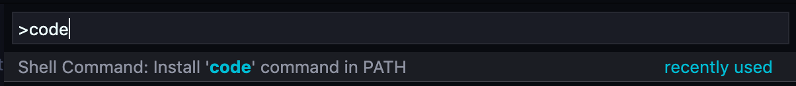
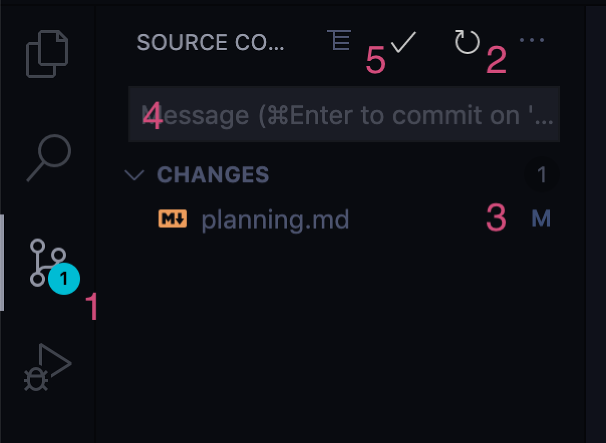
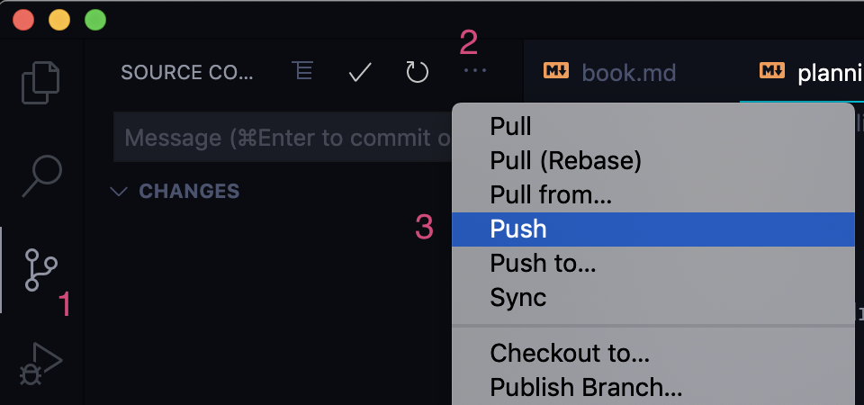
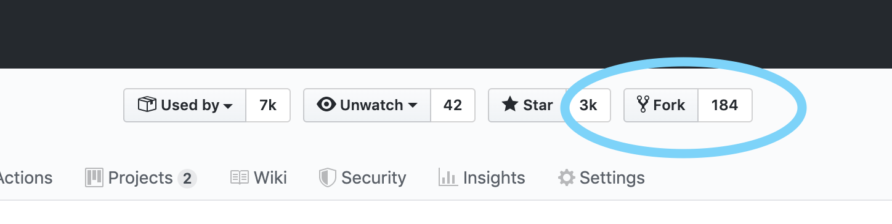

# CLI

The following commands will be useful:

- `ls` - show all files and directories in the current directory
- `cd [directory]` - Enter the specified directory (same thing as double-clicking a folder in Finder/Explorer)
  - `cd ..` will go up one level
- `pwd` - prints your current location in the filesystem
- `mkdir [name]` - create a new directory with the specified name

(These commands work cross-platform if using `git-bash` on windows. Power shell users might have slightly different commands)

## VS Code

VS Code comes with its own command-line utility. First you need to install it.

In VS Code, press ctrl+shift+P (or cmd+shift+P) to open the command palette. Type the word "code" and select the option "Shell Command: Install 'code' command in PATH".



After this is done, you can use the following command:

- `code [directory]` - opens the specified directory in VS Code
  - `code .` opens the current directory

---

# Git

In VS Code, the "Metro map" icon opens the "Source control" panel.

The very first time you do this, you'll need to "initialize a repository".

A "repository" is a fancy name for "project". By creating a repository, you're telling Git to track all files in the current directory as a single project.

## Committing changes

1. Click the "metro map" icon to open the Git panel
2. Click the "Refresh" icon to make sure VS Code knows about your changes.
3. Click the `+` to "stage" (select) files to commit.
4. Write a message in the textbox
5. click the checkmark to create a commit.



A commit is a "save point" for all files you've committed.

---

# Github

Github is a home for Git repositories.

It's kind of a social network, but for coders to work together.

## Getting code to Github

You can _push_ your Git repository to Github. You can _pull_ to update the files on your local machine.

When you create a repository on Github, you'll want to point your existing work to that repository. Run the following command:

```
git remote add origin [URL from Github]
```

A "remote" is another place that your code lives (as in, "a second home on a remote island"). We're adding a new remote so that our code lives both on our computer and on Github. We're naming that new home `origin`. We could choose whichever name we want, but by convention, Github is always "origin".

In VS Code, we can push our code by:

1. Clicking the "metro map" icon
2. Clicking the three dots `...`
3. Selecting "Push"



The first time you do this, you'll get a prompt about upstream branches. Confirm this prompt.

## Getting code from Github

Git lets us copy any Git projects to our machine.

On Github, look for the "Clone or download" button, and click the clipboard icon to copy the URL to the clipboard.

In the terminal, `cd` into the parent folder (eg. `/Users/your-name/work`), and run the following:

```
git clone [Git URL]
```

> (Instead of writing [Git URL], paste the value copied to your clipboard)

You can clone any public code on Github to create a local copy.

## Forking code

The thing about cloning: you aren't given any rights to that code. You can pull it, but you can't push changes. You aren't authorized.

You can "fork" a repository on Github to create your own copy on Github. You are the owner of this copy, so you can make whatever changes you want.

Click the "Fork" button on any Github repository (when logged in) to create your own copy:



After the fork is complete, you'll be able to `clone` your new repo onto your local machine. Because you've cloned _your fork_, and not the original, you're free to push whatever changes you wish to Github.
