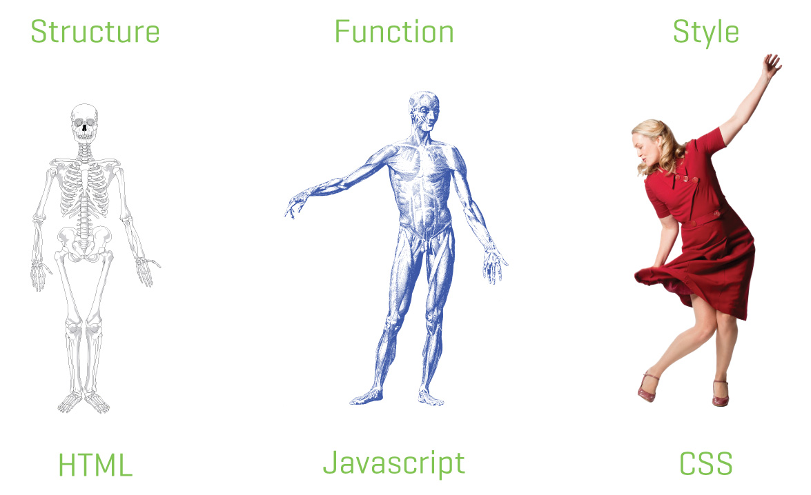

# 1.2.1 - CSS or Counterfeit Stainless Steel

---

_\*actually it's Cascading Style Sheets_

---



---

- We use CSS to change the look of our content.
- CSS is used to change page layout, colors, fonts, text-sizes, image size, etc…
- You can do almost anything _presentational_ with CSS.
- You are limited only by your knowledge of CSS.

---

## Link CSS to an HTML page

```html
<head>
  <link href="main.css" rel="stylesheet" />
</head>
```

The `<link>` tag is used to import the CSS file containing rules applying the styles to the DOM elements.

---

### Example (using tags):

```css
h1 {
  font-size: 32px;
}
```

```html
<h1>My Amazing Blog</h1>
```

---

### Example (using classes):

```css
.blog-title {
  font-size: 32px;
}
```

```html
<h1 class="blog-title">My Amazing Blog</h1>
```

---

### Example (using ids):

```css
#blog-title {
  ...don't do it.
  use a class instead
}
```

```html
<h1 id="blog-title">My Amazing Blog</h1>
```

---

## Difference between classes and IDs

- A document can only have _one copy_ of an ID.

```html
<ul>
  <!-- Oh no! Two elements share the same ID! -->
  <li id="thing">Thing 1</li>
  <li id="thing">Thing 2</li>
</ul>
```

---

## Common selectors

CSS Selectors are used to specify on which elements to apply styling.

| Type  | Example     | Note |
| ----- | ----------- | ---- |
| class | `.my-class` | 👍👍 |
| tag   | `body`      | 👍   |
| id    | `#bacon`    | 🚫   |

---

## Selectors can be combined

```css
p.intro {
  font-size: 24px;
}
```

---

## Specificity

What if two selectors clash?

```css
p {
  color: red;
}

.blue {
  color: blue;
}
```

```html
<p class="blue">What color am I?</p>
```

---

## Specificity

Different selectors have different _strengths_.

- A class beats a tag (`.blue` > `p`)
- A _combined_ class+tag beats a class (`p.blue` > `.red`)
- An ID beats just about everything (`#thing` > `.blue`)

---


---

When styling HTML, we should:

- ALWAYS use classes.
- SOMETIMES use HTML tags.
- NEVER use ids.

---

[Next lecture: CSS](../lecture-2-properties)
