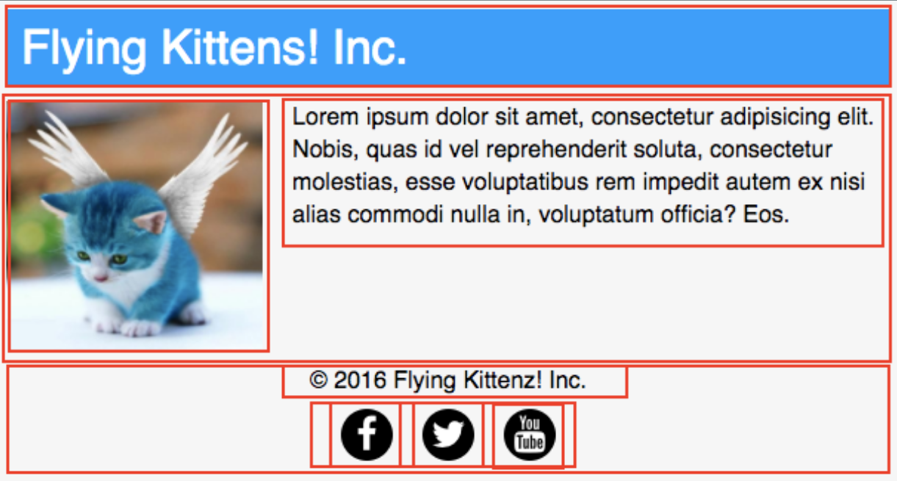
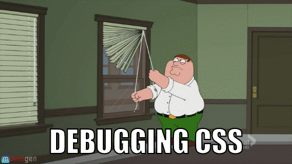

# 1.2.2 - CSS Properties

---

CSS Properties are used to indicate which styles to apply.

```css
.mybox {
  color: #000;
  border: 1px solid red;
  background-color: red;
}
```

fdsfsd

---

- There are many CSS properties.
- [Big reference](https://developer.mozilla.org/en-US/docs/Web/CSS/Reference#Keyword_index)
- VS Code can also autocomplete (Demo!)

---

## Google is your friend

The human brain cannot hold the full library of CSS properties and values.

The internet has many very good resources on CSS.

---

### Exercise 1 [🐇](https://codepen.io)

Write the CSS to make the cat text blue.

```css
/* css here */
```

```html
<p class="canine">Husky</p>
<p class="feline">Felix the Cat</p>
<p class="canine">Labrador</p>
```

---

### Exercise 2 [🐇](https://codepen.io)

Write the CSS to make sub-headings blue

```css
/* css here */
```

```html
<h1>Types of animals</h1>
<h2>Dogs</h2>
<p>Dogs are animals</p>
<h2>Cats</h2>
<p>Cats are also animals</p>
```

---

### Exercise 3 [🐇](https://codepen.io)

Write the CSS to make the cat text blue.

```css
/* css here */
```

```html
<p id="royalcat" class="good-boy">Husky</p>
<p class="royalcat">Felix the cat</p>
```

---

### Exercise 4 [🐇](https://codepen.io)

Write the CSS to make the dogs text red.

```css
/* css here */
```

```html
<p class="canine">Husky</p>
<p class="feline">Felix the cat</p>
<p class="canine">labrador</p>
```

---

### Exercise 5 [🐇](https://codepen.io)

Target specifically cat animals, and not categories

```css
/* css here */
```

```html
<ul class="categories">
  <li class="cat">Agriculture</li>
  <li class="cat">Food service</li>
  <li class="cat">Technology</li>
</ul>

<p class="animal dog">Husky</p>
<p class="animal cat">Felix the cat</p>
<p class="animal dog">Labrador</p>
```

---

### Exercise 6 [🐇](https://codepen.io)

What color is the `p` element?

```css
.blue {
  color: blue;
}
p {
  color: red;
}
```

```html
<p class="blue">hello</p>
```

---

## The Box Model

---

Every HTML element is a box that has 4 properties.

| property  | notes                   |
| --------- | ----------------------- |
| content   | the content             |
| `padding` | space around content    |
| `border`  | border around padding   |
| `margin`  | space outside of border |

---


- Each side can be set independently

|                 |
| --------------- |
| `margin-left`   |
| `margin-right`  |
| `margin-bottom` |

---

- Shorthand is best
  - `margin: top | right | bottom | left`
  - `margin: 20px 10px 5px 0`
  - `margin: 20px 10px`
  - `margin: 20px`

---

### Example

What is the width and height of this box?

```css
.greeting {
  border: 10px solid;
  height: 100px;
  margin: 50px;
  padding: 25px;
  width: 100px;
}
```

```html
<p class="greeting">Hello</p>
```

---

We can fix this with the `box-sizing` CSS property.

```css
* {
  box-sizing: border-box;
}
```

_What is the meaning of `*`?_

---



---

## The [Display](https://www.w3schools.com/cssref/pr_class_display.asp) property

- block
- inline-block
- inline
- none
- _there are many more_

---

### `display: block`

- It starts on a new line, and takes up the whole width.

---

### `display: inline`

- Displays an element as an inline element.
- Any height and width properties will have no effect.

---

### `display: inline-block`

- The element itself is formatted as an inline element, but you can apply height and width values.

---

### `display: none`

- The element is completely removed!

---

### Elements already have their own display behavior

- Block-level elements
  - `<h1>`, `<h2>`, `<h3>`, `<h4>`, `<h5>`, `<h6>`, `<p>`
  - `<ul>`, `<ol>`, `<li>`, `<blockquote>`, `<table>`,
  - `<form>`
  - `<div>`

---

- Inline elements
  - ``, `<a>`, `<span>`, `<button>`
  - `<input>`, `<label>`, `<select>`, `<textarea>`
  - `<abbr>`

[Source](https://www.w3resource.com/html/HTML-block-level-and-inline-elements.php)

---

### Investigate later

[Display property playground](https://www.w3schools.com/csSref/playit.asp?filename=playcss_display&preval=inline)

---

`display: none` vs `visibility: hidden`

---

## The [Position](https://www.w3schools.com/css/css_positioning.asp) property

- static (_default_)
- relative
- fixed
- absolute

---

### `position: static`

- It is not positioned in any special way; it is always positioned according to the normal flow of the page.

---

### `position: relative`

- It is positioned relative to its normal position.
- Setting the top, right, bottom, and left properties of a relatively-positioned element will cause it to be adjusted away from its normal position. _Other content will not be adjusted to fit into any gap left by the element._

---

### `position: fixed`

- It is positioned relative to the viewport.
- It always stays in the same place even if the page is scrolled.
- The top, right, bottom, and left properties are used to position the element.
- It is pulled out of the flow of content.

---

### `position: absolute`

- It is positioned relative to the nearest positioned ancestor (instead of positioned relative to the viewport, like fixed).
- If an absolute positioned element has no positioned ancestors, it uses the document body, and moves along with page scrolling.

---

Note: When using the `absolute` property, you will need to set the parent's position as well, anything but `static`.

https://codepen.io/joshwcomeau/pen/OJVYZZO

---

## The [`z-index`](https://www.w3schools.com/cssref/pr_pos_z-index.asp) Property

- The z-index property specifies the stack order of an element.
- An element with greater stack order is always in front of an element with a lower stack order.
- It only works on _positioned_ elements (absolute, relative, fixed, or sticky).

- https://developer.mozilla.org/en-US/docs/Web/CSS/z-index

---

## Flexbox

Flexbox is a wonderful way of positioning elements on a webpage.

It has a bit of a learning curve though

---

### The problem

What if we want two block-level elements to sit side by side?

What if they should take up equal amounts of space?

---

### The solution

- Give the parent container the property `display: flex`.

You can control how they should be sized.

Demo: https://codepen.io/joshwcomeau/pen/abOrjoV

---

### Flex properties

There are other properties you can give the parent container:

| property          | notes               |
| ----------------- | ------------------- |
| `flex-direction`  | default is `row`    |
| `flex-wrap`       | default is `nowrap` |
| `justify-content` | main axis           |
| `align-items`     | secondary axis      |

---

The most common recipe for a container is

```css
.container {
  display: flex;
  justify-content: center;
  align-items: center;
}
```

---

### Children can have `flex` properties too!

| property | notes                         |
| -------- | ----------------------------- |
| `flex`   | allow items to grow or shrink |
| `order`  | modify source order           |

---

### Additional Resources

- [Complete Guide to Flexbox](https://css-tricks.com/snippets/css/a-guide-to-flexbox/)
- [Flexbox.help](https://flexbox.help/)
- [Flexbox.ninja](https://flexbox.ninja/)

---



---
