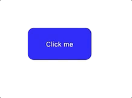

# 1.2 - CSS: The Basics - Workshop

## Stretch goal

Using CSS, create a button that animates on hover:

- It should color to a dark-blue when focused. It should **not** have the typical "focus ring" (blue outline on MacOS, dotted outline on Windows).
- It should shrink when the mouse is held down on it.
- It should be animated

### Necessary properties/techniques

- You'll need the `:active` and `:focus` pseudoselectors
- You'll also need to use the `transform: scale` property for the size change, and the `transition` property for the animation.
- You can disable the outline with `outline: none`, but **you should only do this if you have an alternative focus state**. That outline is very important for keyboard users, to know which element is focused.

### Resources

https://css-tricks.com/almanac/selectors/a/active/
https://css-tricks.com/almanac/selectors/f/focus/
https://css-tricks.com/almanac/properties/t/transition/
https://developer.mozilla.org/en-US/docs/Web/CSS/transform-function/scale
