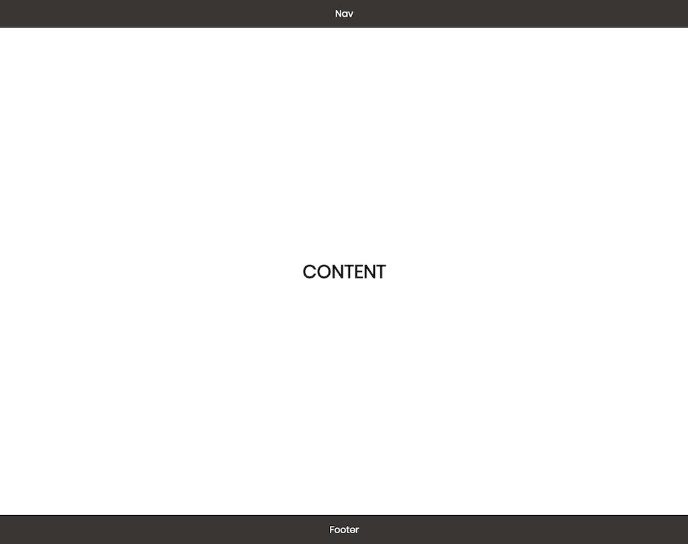

# 1.2 - CSS: Page Layout - Workshop

## Exercise 1 - Use Flexbox

Create an `index.html` file and a `style.css` file that reproduces the following:



### Reference

Your HTML should have the following structure:

```html
<!DOCTYPE html>
<html>
  <head>
    <link href="style.css" rel="stylesheet" />
  </head>

  <body>
    <div class="container">
      <!-- Stuff here -->
    </div>
  </body>
</html>
```

- Give the `<body>` a `0` margin.
- Use HTML5 tags whenever possible.
- To ensure that the content height is at least as tall as the viewport, you will need to set the height on your `<div class="container">`
  - `min-height: 100vh`
- Use the Poppins font (google fonts) _optional_

### Properties Needed

```
  font-family
  flex-direction
  min-height
  height
  background-color
  color
  display
  align-items
  justify-content
  flex
```
