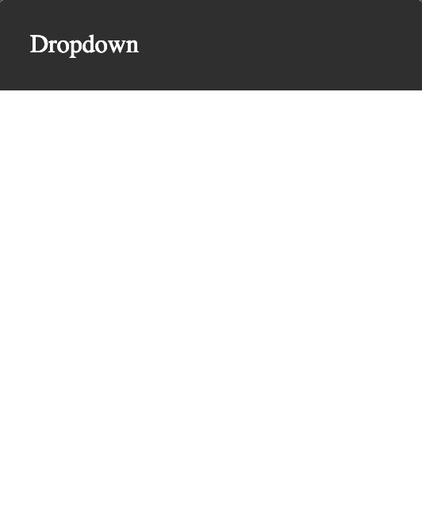

# 1.2 - CSS: Page Layout - Workshop

## Exercise 6

Update the `index.html` file and `style.css` file to reproduces the following:



### Properties Needed

```
position
top
left
display
margin
list-style-type
padding
background-color
:hover
```
