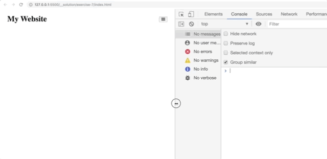

# 1.2 - CSS: Page Layout - Workshop

## Exercise 7

Update **only the style.css** file to reproduces the following:



- You'll want to use media queries to selectively show the mobile/desktop version. You can use 800px as the cutoff.
- You'll need 2 `display: flex` containers (but you don't need to change the HTML, you can apply these on the elements).
- You'll want to add some margin to the desktop nav items, so they aren't stuck together.
- The pseudo-selector `:last-of-type` is useful to avoid having any right margin on the last desktop nav item (again, no HTML changes required).

### Syntax needed

```
@media
:last-of-type
```

### Properties Needed

```
display
justify-content
align-items
padding
margin
list-style
```
