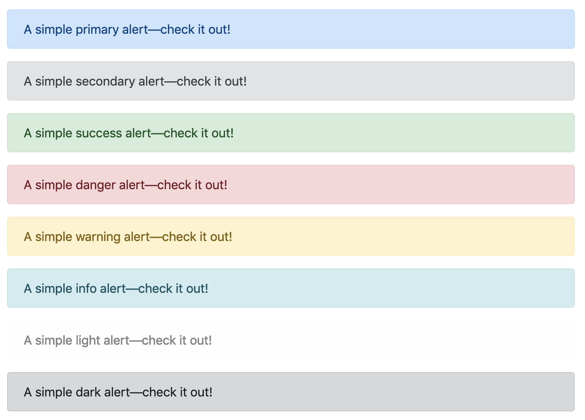

# Exercise 13 - Optional

Create an HTML file and a CSS file that outputs the following



```html
<div class="alert alert-primary">
    <p>A simple primary alert.</p>
</div>

<div class="alert alert-secondary">
    <p>A simple secondary alert.</p>
</div>

...
```
