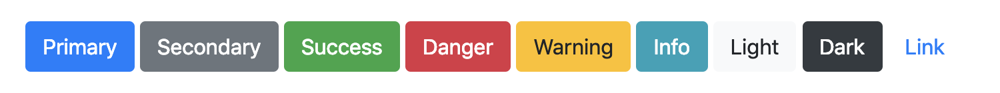

# Exercise 14 - Optional

Create an HTML file and a CSS file that outputs the following



```html
<button type="button" class="btn btn-primary">Primary</button>
<button type="button" class="btn btn-secondary">Secondary</button>

...
```

Note: The `type="button"` attribute isn't important for this exercise
