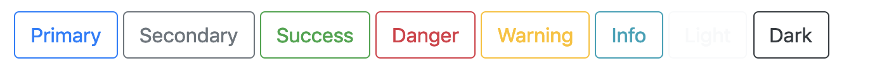

# Exercise 15 - Optional

Create an HTML file and a CSS file that outputs the following

Build upon what you did in exercise 14.



```html
<button type="button" class="btn btn-outline-primary">Primary</button>
<button type="button" class="btn btn-outline-secondary">Secondary</button>

...
```

Note: The `type="button"` attribute isn't important for this exercise

