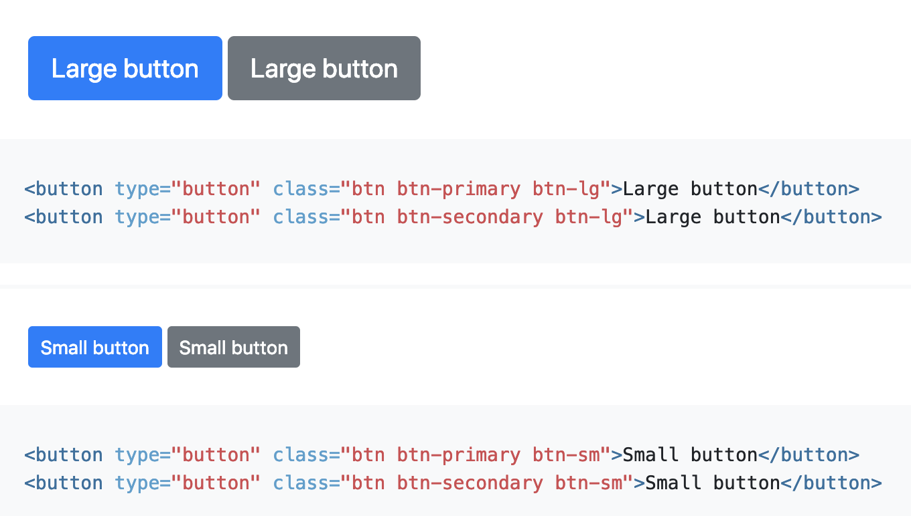
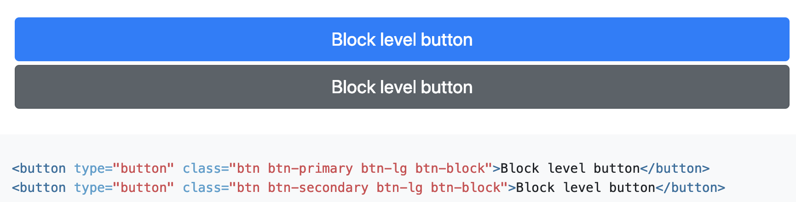
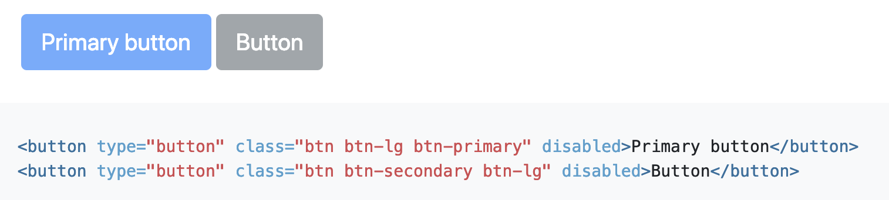

# Exercise 16 - Optional

Create an HTML file and a CSS file that outputs the following

Build upon what you did in previous exercise 14 and 15.

## Part 1

## Part 2

## Part 3

Note: The `type="button"` attribute isn't important for this exercise
