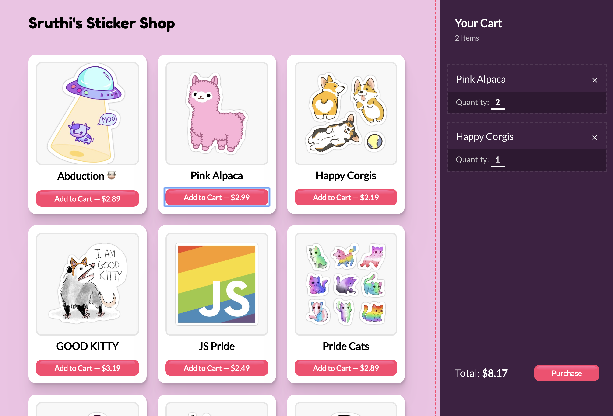
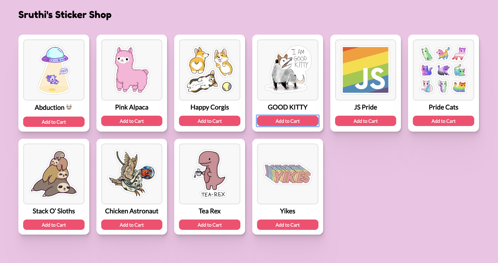

# Redux Workshop - Shopping Cart

Today we'll build a shopping cart for a sticker store:

You can play with this live: http://redux-cart.surge.sh/

## Initial setup

The workshops starts us off with a basic "store listing" page. Lots of items are for sale, but nothing is wired up; there's no behaviour yet.

Please take a moment to poke at the existing components, and learn how the app is structured.

---

## Exercises

### Exercise 1: Initial Redux setup

Open this exercise file: [exercise-1.md](__workshop/exercise-1.md)

### Exercise 2: Cart styling

Open this exercise file: [exercise-2.md](__workshop/exercise-2.md)

### Exercise 3: Adding and rendering cart items

#### 3A: Getting state into the redux store

Open this exercise file: [exercise-3A.md](__workshop/exercise-3A.md)

#### 3B: Rendering stuff from the Redux store

Open this exercise file: [exercise-3B.md](__workshop/exercise-3B.md)

### Exercise 4: Removing items from the cart

Open this exercise file: [exercise-4.md](__workshop/exercise-4.md)

---

🟡 - Minimally complete workshop (75%) - 🟡

---

### Exercise 5: Quantities

Open this exercise file: [exercise-5.md](__workshop/exercise-5.md)

### Exercise 6: Devtools!

Open this exercise file: [exercise-6.md](__workshop/exercise-6.md)

---

🟢 - Complete workshop (100%) - 🟢

---

### Stretch Goals

Open this exercise file: [stretch-goals.md](__workshop/stretch-goals.md)
