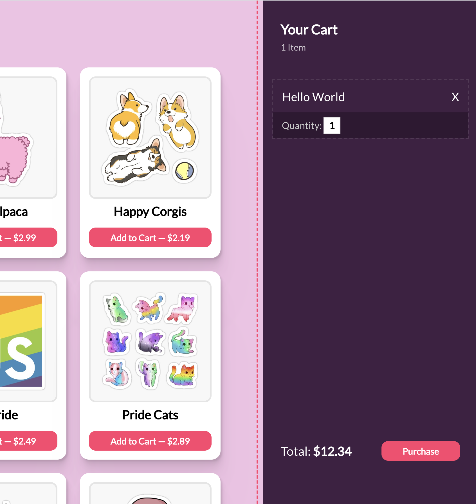

# Exercise 2: Cart styling

Take some time to create the components and styles we'll need for the shopping cart!

It's up to you how to structure this, but one way to do this involves creating two new components:

- `<Cart />`
- `<CartItem />`

For now, feel free to use fake data. Make sure that your cart UI looks something like this:

This is a "rough" match of the final solution. It's up to you how closely you want to match the styling.

**HINT:** If you'd rather not use the letter "X" for the close button, feel free to use react-icons-kit!

**HINT:** If you want the input to have that "underline" style, set the background to transparent, and remove all but the bottom border.
