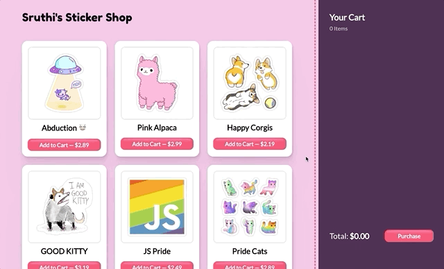
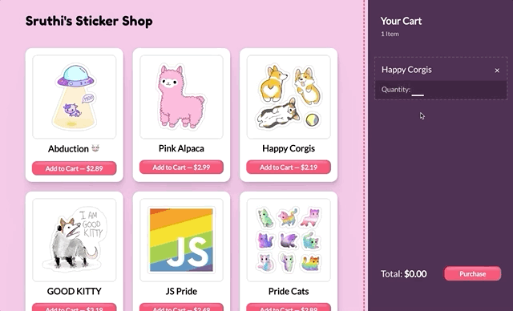

# Exercise 5: Quantities

We want to let the user change the quantity of items in the cart, in two different ways:

1. Clicking the "Add to cart" button should add 1 more quantity each time:

2. Typing a new number in the input:

Once again, this will be left up to you. The nice thing about Redux is that it's generally pretty consistent: new features follow the same patterns.

**HINT:** For clicking "Add to cart", it can continue to use the `ADD_ITEM` action. You'll need to tweak the reducer, to increment the quantity in that slice of the reducer.

**HINT:** For interacting with the "Quantity" input, you'll want to create a new action, `UPDATE_QUANTITY`. The action will need two pieces of information: the new quantity, and the item ID.

**HINT:** We want the "Total" shown in the bottom right to update immediately, so be sure to dispatch the action when the user types in the input (_onChange_).
